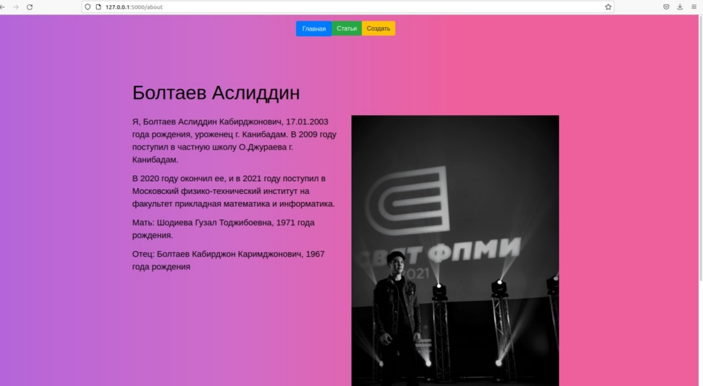
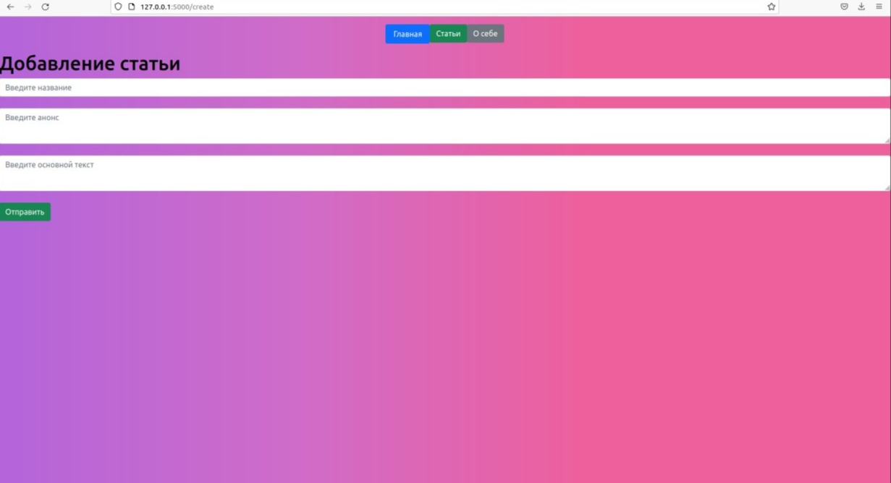
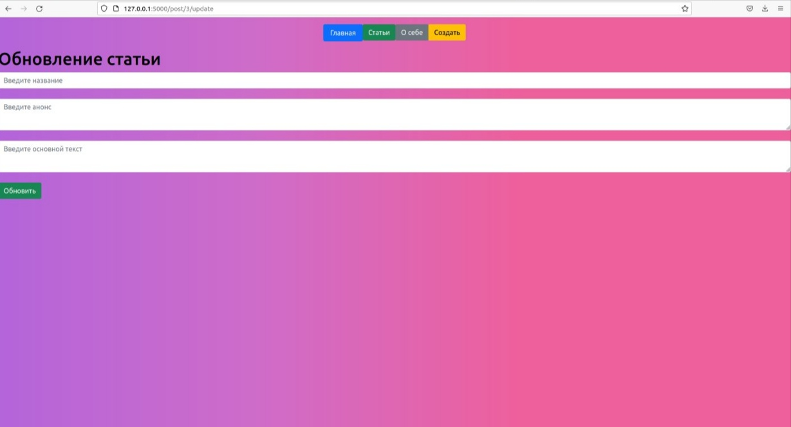

# [Flask-приложение](https://ru.wikibooks.org/wiki/Flask)

Этот [__веб преложинея__](https://ru.wikipedia.org/wiki/%D0%92%D0%B5%D0%B1-%D0%BF%D1%80%D0%B8%D0%BB%D0%BE%D0%B6%D0%B5%D0%BD%D0%B8%D0%B5) написано в языках прогромировании [__Python__](https://ru.wikipedia.org/wiki/Python), [__html__](https://ru.wikipedia.org/wiki/HTML), [__css__](https://ru.wikipedia.org/wiki/CSS). Я использовал библиотеку [__flask__](https://ru.wikipedia.org/wiki/Flask_(%D0%B2%D0%B5%D0%B1-%D1%84%D1%80%D0%B5%D0%B9%D0%BC%D0%B2%D0%BE%D1%80%D0%BA)) из [__Python__](https://ru.wikipedia.org/wiki/Python).
Оно содержит в себе 6 страницы:
- __Главная страница__
- __Страница про нас__
- __Добавление статьи__
- __Все статьи на сайте__
- __Обновление статьи__
- __Название статьи__
___
# __Главная страница__

___
# __Страница про нас__

___
# __Добавление статьи__

___
# __Все статьи на сайте__

___
# __Название статьие__

___
# __Обновление статьи__

___
__Бонусные части:__
- Красивая верстка
- Хранение данных не в памяти, а в БД
#
__Нужные команды для клонирование репозитории и установки необходимых фавлов__
***
    git clone https://github.com/asliddin03/Python_2_reveiw.git
    cd Site
    ./script

#
Далее в адресном пле вашего браузера вводите 127.0.0.1:5000, после чего вам покажется главная страница сайта.